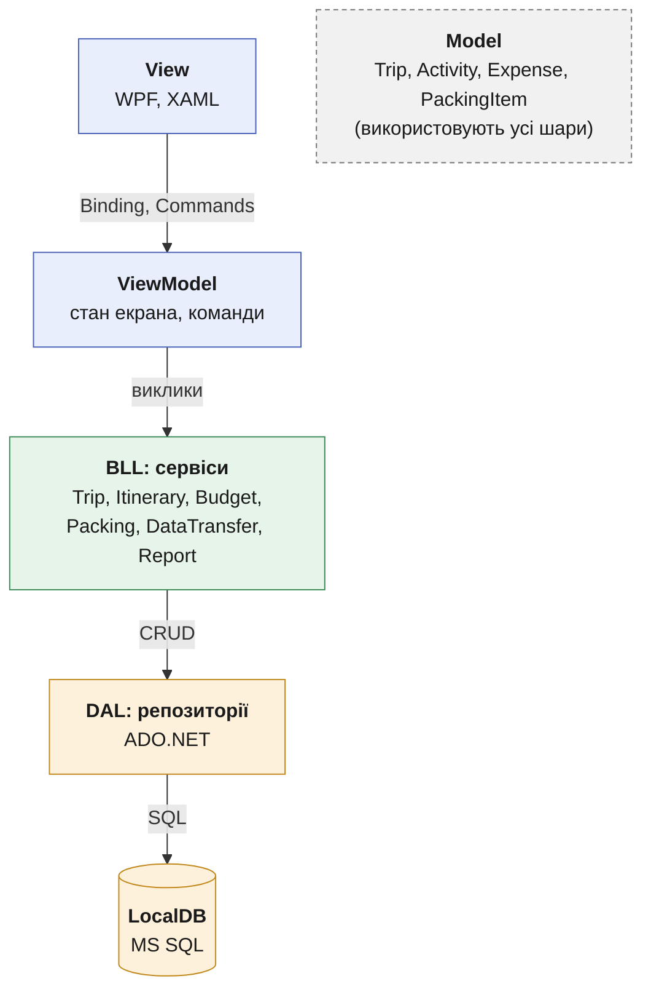
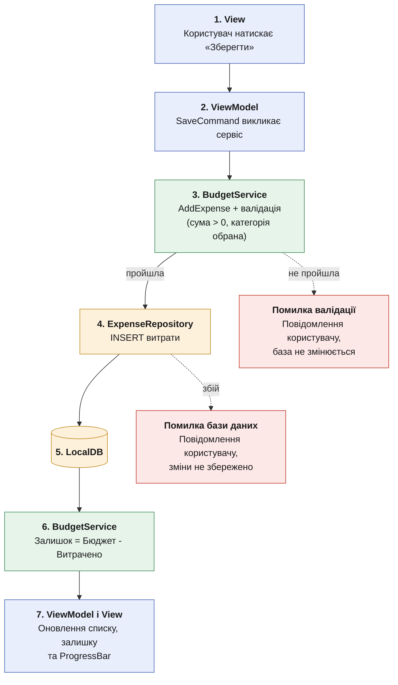

# Архітектура TripFlow

## 1. Обраний архітектурний підхід

TripFlow — **монолітний десктопний застосунок (WPF, .NET 8)** з **трирівневою архітектурою (UI → BLL → DAL)** та шаблоном **MVVM** на рівні інтерфейсу. Дані зберігаються локально в **MS SQL LocalDB**, доступ до даних — через репозиторії на **ADO.NET**.

## 2. Діаграма шарів

| Шар | Що робить | Чого НЕ робить |
|---|---|---|
| View | Показує дані, приймає дії користувача | Не містить логіки й не звертається до бази |
| ViewModel | Зберігає стан екрана, викликає сервіси, показує помилки | Не рахує і не працює з БД |
| BLL (сервіси) | Валідація, розрахунок залишку та % зборів, сортування активностей, формування JSON і PDF | Не знає про вікна WPF |
| DAL (репозиторії) | Зберігає, читає, видаляє записи в LocalDB | Не містить правил і розрахунків |
| Model | Класи даних | Не містить логіки доступу до даних |

## 3. Правила взаємодії шарів

1. View працює лише з ViewModel (прив'язки та команди).
2. ViewModel викликає лише сервіси.
3. Сервіси звертаються до бази лише через репозиторії.
4. Валідація виконується в сервісах.
5. Довгі операції (експорт, імпорт, PDF) виконуються асинхронно, щоб вікно не зависало.
6. Помилки не валять програму: сервіс повертає зрозуміле повідомлення, ViewModel показує його користувачеві.
7. Діалоги вибору файлу викликає інтерфейс, сервіс отримує лише шлях до файлу.

## 4. Приклад потоку: додавання витрати

Якщо залишок менше 0, ProgressBar стає червоним.

## 5. Обґрунтування ключових рішень

| Рішення | Чому саме так | Відкинута альтернатива і чому |
|---|---|---|
| Монолітний десктоп (WPF, .NET 8) | Вимога автономності: працює без мережі, без сервера й хостингу, дані залишаються в користувача | Веб або клієнт-сервер: потребують інтернету й інфраструктури, що суперечить меті проєкту |
| MVVM | Рідний шаблон WPF: прив'язки та команди. Залишок і ProgressBar оновлюються автоматично, ViewModel можна тестувати без UI | Code-behind: логіка змішується з вікнами, складно тестувати |
| Трирівнева архітектура | Правила й розрахунки (BLL) не залежать ні від вікон, ні від бази. Кожен шар спілкується лише з сусіднім | Єдиний шар: дублювання валідації. Clean Architecture / DDD: надто громіздко для застосунку такого масштабу |
| Валідація в BLL | Одне місце для правил: бюджет і сума не від'ємні, дата завершення не раніша за початок. Некоректні дані не потрапляють у БД | Валідація у ViewModel: правила розмазуються по екранах |
| Репозиторії + ADO.NET | Доступ до даних ізольований, SQL-запити під повним контролем, мінімум залежностей | EF Core: зручний, але додає залежність і складність, яка не потрібна для невеликої моделі |
| LocalDB (MS SQL) | Реляційна модель підходить до зв'язків Trip → Activity / Expense / PackingItem (1:N), є цілісність даних і SQL для фільтрації. Не потребує окремого сервера | JSON-файли: слабка цілісність і повільний пошук. Повний SQL Server: потребує встановлення й адміністрування |
| Async для довгих операцій | Експорт, імпорт і PDF не «заморожують» вікно | Синхронні виклики: вікно зависає |
| Обробка помилок через сервіси | Програма не падає (вимога надійності), користувач бачить зрозуміле повідомлення | Необроблені винятки: аварійне завершення |
| JSON для експорту та імпорту, PDF для звіту | JSON зберігає повну структуру для переносу й резервної копії, PDF зручний для друку та пересилання | Лише .txt: губиться структура, неможливий імпорт |
